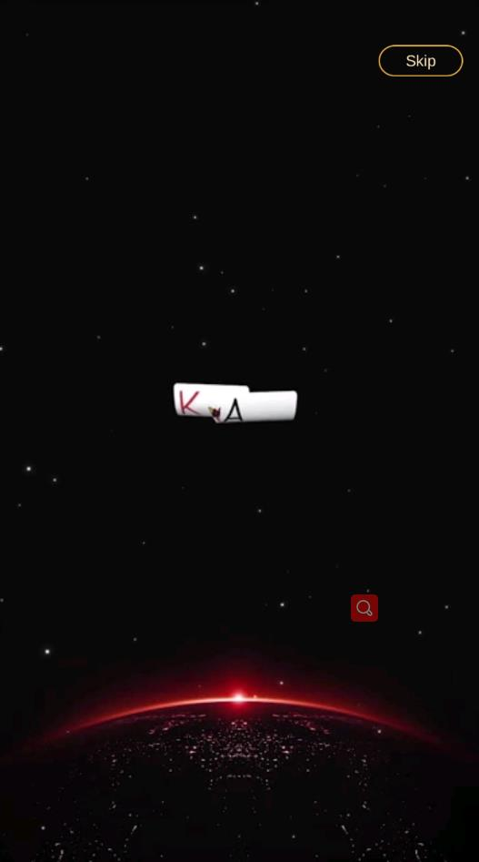
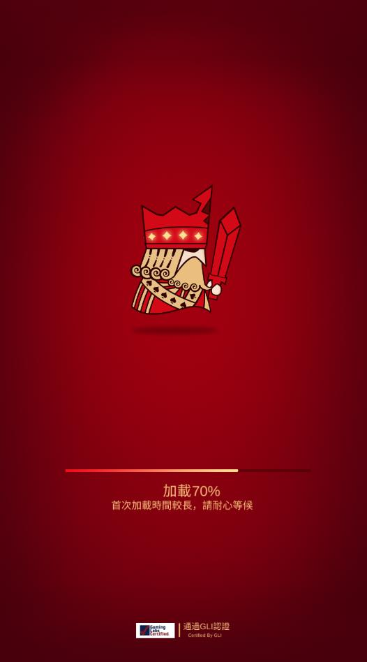
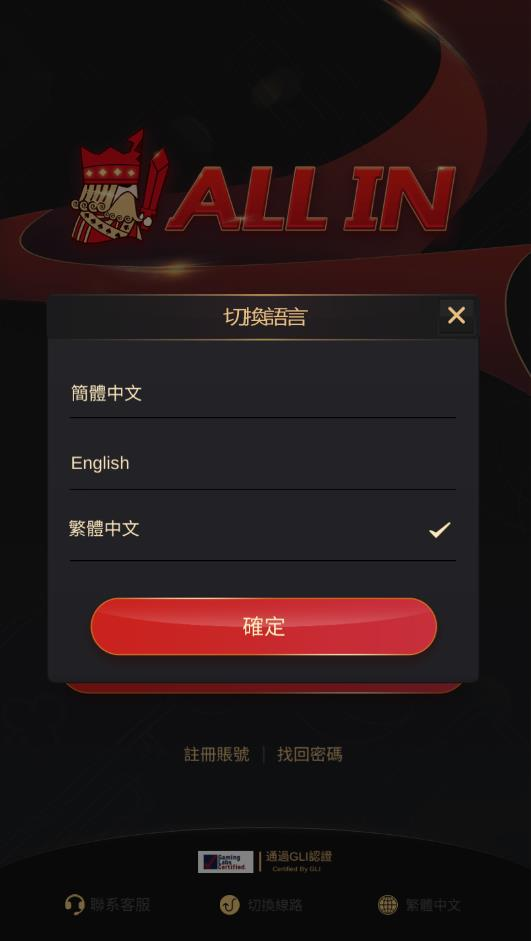
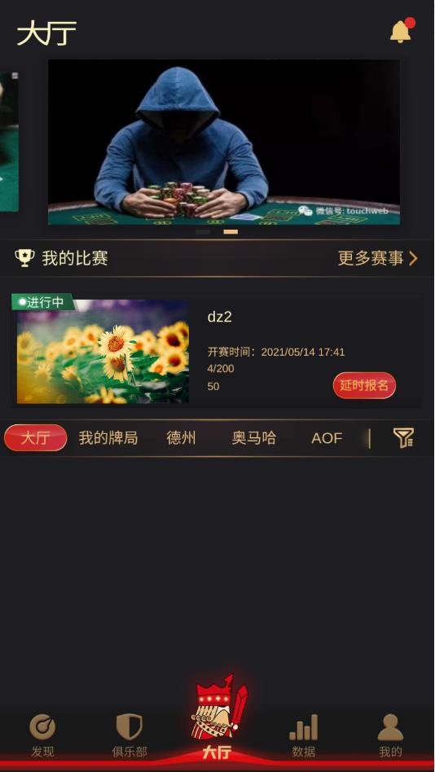

# 红德州 - 在线德州扑克游戏平台

[](https://www.reddezhou.com)
[](https://www.oracle.com/java/)
[](https://unity.com/)
[](https://vuejs.org/)

一个功能完整的在线德州扑克游戏平台，采用现代化微服务架构，包含完整的服务端、运营后台和Unity游戏客户端。

## 🎯 项目简介

红德州是一个基于微服务架构的在线扑克游戏平台，采用前后端分离设计，提供完整的商业解决方案。

**核心优势**：
- ✅ **完整的前后端匹配**：服务端、运营后台、Unity客户端完全匹配
- ✅ **现代化技术栈**：Java 8 + Netty + Vue.js + Unity
- ✅ **快速部署上线**：5-10个工作日即可部署完成
- ✅ **专业的技术支持**：7x24小时技术支持，2小时内响应

## 🎮 核心功能

### 游戏功能
- **多种扑克游戏**：德州扑克、奥马哈、短牌
- **锦标赛系统**：支持MTT、SNG等赛事
- **俱乐部系统**：创建和管理扑克俱乐部
- **实时对战**：基于TCP Socket的实时通信
- **牌谱系统**：游戏记录和回放功能

### 运营功能
- **用户管理**：完整的用户管理系统
- **支付系统**：充值、提现、资金管理
- **数据统计**：实时数据分析和报表
- **活动配置**：灵活的活动配置系统
- **消息推送**：站内消息和推送通知

## 💻 技术栈

### 后端技术
| 技术 | 版本 | 用途 |
|------|------|------|
| Java | 8 | 开发语言 |
| Netty | 4.1.6 | 网络通信框架 |
| MySQL | 5.1.18 | 主数据库 |
| MongoDB | 3.2.2 | 日志和缓存 |
| Redis | 2.8.1 | 缓存服务 |
| RabbitMQ | 5.4.3 | 消息队列 |
| Zookeeper | 2.12.0 | 服务注册与发现 |
| Spring Boot | 2.x | 应用框架 |

### 运营后台技术
| 技术 | 版本 | 用途 |
|------|------|------|
| Vue.js | 2.6.6 | 前端框架 |
| ElementUI | 2.4.5 | UI组件库 |
| Vue Router | 3.0.1 | 路由管理 |
| Vuex | 3.0.1 | 状态管理 |
| ECharts | 4.2.1 | 数据可视化 |

### Unity客户端技术
| 技术 | 版本 | 用途 |
|------|------|------|
| Unity | 2019.x | 游戏引擎 |
| C# | 6.0+ | 开发语言 |
| ET Framework | - | 游戏框架 |
| Protobuf | - | 协议序列化 |
| 腾讯IM | - | 即时通讯 |

## 📁 项目结构

```
reddezhou/
├── Server/                          # 服务端代码
│   └── dz/                         # 德州扑克服务
│       ├── game/                    # 游戏服务模块
│       │   ├── login/              # 登录认证服务
│       │   ├── room/               # 房间服务
│       │   ├── mtt/                # 锦标赛服务
│       │   ├── omaha/              # 奥马哈扑克
│       │   ├── pay/                # 支付服务
│       │   ├── res/                # 资源服务
│       │   └── yunying/            # 运营后台
│       ├── web/                    # 前端项目
│       │   └── mis/                # 后台管理系统
│       └── sql/                    # 数据库脚本
├── docs/                           # 项目文档
│   ├── TECHNICAL_ARCHITECTURE.md  # 技术架构文档
│   ├── CLIENT_SETUP.md           # 客户端配置指南
│   ├── DEPLOYMENT.md             # 部署文档
│   └── ...                        # 更多文档
└── README.md                       # 项目说明
```

## 🚀 快速开始

### 前置要求
- JDK 1.8+
- Node.js 12+
- MySQL 5.x
- MongoDB 3.x
- Redis 3.x
- Zookeeper 3.x
- RabbitMQ 3.x

### 快速演示（运营后台）

如果只想查看运营后台界面，可以只启动前端项目：

```bash
# 进入运营后台项目目录
cd Server/dz/web/mis

# 安装依赖
npm install

# 启动开发服务器
npm run serve

# 访问 http://localhost:8080
```

### 完整部署

详细的部署步骤请参考以下文档：

- [部署文档](docs/DEPLOYMENT.md) - 完整的部署流程
- [技术架构文档](docs/TECHNICAL_ARCHITECTURE.md) - 详细的技术架构说明
- [客户端配置指南](docs/CLIENT_SETUP.md) - Unity客户端配置
- [演示准备清单](docs/DEMO_CHECKLIST.md) - 演示前的准备事项

## 📊 技术架构

```
┌─────────────────────────────────────────────────────────────┐
│                         客户端层                              │
├─────────────────────────────────────────────────────────────┤
│  Unity客户端  │  Web浏览器  │  移动端App  │  PC客户端       │
└─────────────────────────────────────────────────────────────┘
                              │
                              │ HTTP/WebSocket/TCP
                              ▼
┌─────────────────────────────────────────────────────────────┐
│                         负载均衡层                            │
├─────────────────────────────────────────────────────────────┤
│  Nginx  │  HAProxy  │  SLB  │  CDN                          │
└─────────────────────────────────────────────────────────────┘
                              │
                              ▼
┌─────────────────────────────────────────────────────────────┐
│                         服务层                                │
├─────────────────────────────────────────────────────────────┤
│  登录服务  │  房间服务  │  锦标赛  │  支付  │  运营后台      │
└─────────────────────────────────────────────────────────────┘
                              │
                              ▼
┌─────────────────────────────────────────────────────────────┐
│                         数据层                                │
├─────────────────────────────────────────────────────────────┤
│  MySQL  │  MongoDB  │  Redis  │  RabbitMQ  │  Zookeeper    │
└─────────────────────────────────────────────────────────────┘
```

## 💼 技术服务

我们提供以下技术服务：

### 服务套餐

| 套餐 | 价格 | 周期 | 适用 |
|------|------|------|------|
| 套餐A | 5-20万 | 5-10工作日 | 小型运营商 |
| 套餐B | 50-200万 | 28-55工作日 | 中型运营商 |
| 套餐C | 200-500万 | 60-120工作日 | 大型运营商 |

### 服务内容

**套餐A：基础部署服务**
- 环境搭建（服务器、数据库、中间件）
- 项目部署（服务端、运营后台、客户端）
- 数据库初始化
- 基础配置
- 测试验证

**套餐B：高级定制服务**
- 功能定制
- 界面定制
- 协议调整
- 性能优化
- 安全增强

**套餐C：企业级服务**
- 完整定制
- 技术培训
- 长期支持
- 咨询服务

### 增值服务

| 服务 | 价格 | 说明 |
|------|------|------|
| 运维服务 | 2-10万/月 | 服务器监控、故障处理、性能优化 |
| 技术培训 | 5-20万/次 | 架构培训、开发培训、运维培训 |
| 咨询服务 | 2-20万/次 | 技术咨询、运营咨询、商业咨询 |

## 📖 技术文档

完整的技术文档已公开，您可以了解项目的技术架构和功能：

- [技术架构文档](docs/TECHNICAL_ARCHITECTURE.md) - 详细的技术架构说明
- [客户端配置指南](docs/CLIENT_SETUP.md) - Unity客户端配置
- [部署文档](docs/DEPLOYMENT.md) - 完整的部署流程
- [演示准备清单](docs/DEMO_CHECKLIST.md) - 演示前的准备事项
- [技术服务套餐](docs/TECHNICAL_SERVICE_PACKAGES.md) - 详细的服务套餐说明
- [销售材料](docs/SALES_MATERIALS.md) - 销售材料包括PPT和话术
- [合同模板](docs/CONTRACT_TEMPLATE.md) - 技术服务合同模板
- [销售渠道](docs/SALES_CHANNELS.md) - 销售渠道和策略
- [推广执行计划](docs/PROMOTION_EXECUTION_PLAN.md) - 详细的推广执行计划

## 📸 产品截图

### 运营后台






### 游戏客户端


---

## 🎬 演示视频

### 运营后台演示

[](assets/videos/backend-demo.mp4)

[观看运营后台演示视频](assets/videos/backend-demo.mp4)

**视频内容**：
- 登录系统
- 查看仪表盘
- 用户管理操作
- 游戏房间管理
- 数据统计查看
- 财务管理操作
- 活动配置演示

**视频时长**：3-5分钟

---

### 游戏客户端演示

[](assets/videos/client-demo.mp4)

[观看游戏客户端演示视频](assets/videos/client-demo.mp4)

**视频内容**：
- 游戏登录
- 进入游戏大厅
- 加入游戏房间
- 游戏进行过程
- 游戏结算
- 充值操作
- 个人中心

**视频时长**：3-5分钟

---

## 🌐 在线Demo

### GitHub Pages Demo

**访问地址**：https://622009507.github.io/reddezhou/demo.html

**说明**：
- ✅ 无需下载，直接在浏览器中访问
- ✅ 完整展示产品功能和界面
- ✅ 包含运营后台和游戏客户端截图
- ✅ 支持PC和移动端访问
- ✅ 永久有效，随时访问

**Demo包含内容**：
- ✅ 产品亮点介绍
- ✅ 技术栈展示
- ✅ 运营后台功能截图（登录、仪表盘、用户管理、房间管理、数据统计、财务管理、活动管理）
- ✅ 游戏客户端界面截图（游戏大厅、游戏房间、游戏界面、牌局展示、结算界面、个人中心、充值界面、排行榜、好友系统、设置界面）
- ✅ 快速开始指南

---

### 本地Demo（可选）

如果您想在本地查看Demo，可以：

1. 下载项目到本地
2. 双击打开 `demo.html` 文件
3. 在浏览器中查看完整的产品展示

**优势**：
- 无需联网
- 加载速度快
- 可以修改和定制

---

## 🎥 演示视频

[](https://www.youtube.com/watch?v=VIDEO_ID)

演示视频展示了项目的核心功能：
- 登录流程
- 游戏大厅
- 德州扑克游戏
- 奥马哈游戏
- 锦标赛功能
- 俱乐部功能
- 运营后台

## 💡 项目优势

### 技术优势

1. **现代化技术栈**
   - Java 8 + Netty：高性能网络通信
   - Vue.js + ElementUI：现代化前端框架
   - Unity 2019：成熟的游戏引擎
   - 微服务架构：易于扩展和维护

2. **完整的系统架构**
   - 服务端：完整的游戏逻辑和业务处理
   - 运营后台：完善的管理和数据分析
   - 客户端：完整的游戏体验和交互
   - 支付系统：完整的充值和提现流程

3. **高性能和可扩展性**
   - Netty异步非阻塞IO
   - Redis缓存加速
   - MongoDB日志存储
   - 消息队列解耦

4. **多游戏支持**
   - 德州扑克
   - 奥马哈扑克
   - 短牌扑克
   - 锦标赛（MTT、SNG）

### 商业价值

1. **完整的解决方案**
   - 前后端完全匹配
   - 无需额外开发
   - 快速部署上线
   - 降低开发成本

2. **成熟的商业模式**
   - 多种盈利模式
   - 完整的支付系统
   - 运营后台支持
   - 数据分析功能

3. **灵活的部署方式**
   - 支持多环境配置
   - 云服务器部署
   - 容器化部署
   - 负载均衡支持

4. **持续的技术支持**
   - 完整的文档
   - 详细的部署指南
   - 技术架构说明
   - 开发指南

## 📞 联系我们

### 获取源码

本项目为商业项目，完整源码需要购买授权。

### 联系方式

- **邮箱**：622009507@qq.com
- **电话/微信**：+86-186-2103-6721
- **GitHub**：https://github.com/622009507/reddezhou

### 获取流程

1. **联系我们**：通过邮箱、电话或微信联系我们
2. **确定需求**：选择服务套餐，确定定制需求
3. **签订合同**：签订技术服务合同
4. **支付预付款**：支付合同预付款
5. **获取源码**：通过私有仓库或加密压缩包获取完整源码
6. **技术支持**：提供专业的技术支持和培训

## 📜 许可证

本项目采用双重许可证：

### 个人学习（免费）
- ✅ 个人学习和研究
- ✅ 非商业用途
- ✅ 学术研究

### 商业使用（付费）
- ❌ 运营游戏平台
- ❌ 商业盈利
- 需要购买商业许可证

详见 [LICENSE](LICENSE) 文件。

## ❓ 常见问题

### Q：源码是开源的吗？
A：技术文档完全公开，但完整源码需要购买商业许可证。

### Q：可以自己部署吗？
A：购买商业许可证后，我们提供部署服务，也可以自己部署。

### Q：提供技术支持吗？
A：是的，我们提供7x24小时技术支持，2小时内响应。

### Q：可以定制开发吗？
A：是的，我们提供定制开发服务，包括功能定制、界面定制、协议调整等。

### Q：需要什么技术团队？
A：建议配备Java开发、Unity开发、运维工程师等技术人员。

### Q：支持哪些平台？
A：支持Android、iOS、PC等多平台。

## 🤝 贡献

欢迎提交Issue和Pull Request！

## 📄 更新日志

### v1.0.0 (2026-03-22)
- 初始版本发布
- 完整的游戏功能
- 运营后台系统
- 支付系统集成
- Unity游戏客户端
- 完整的前后端匹配

## 🌟 Star History

如果这个项目对您有帮助，请给我们一个Star！

---

**红德州技术团队** © 2026
